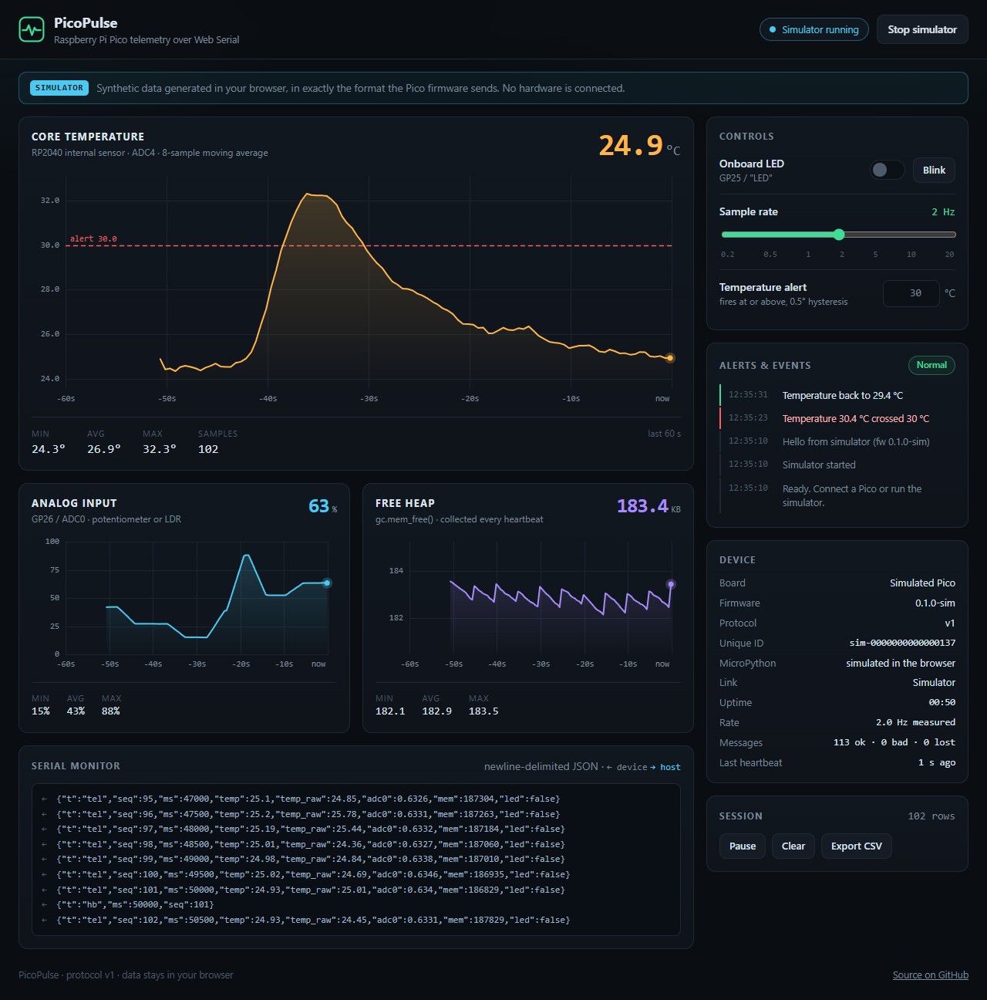
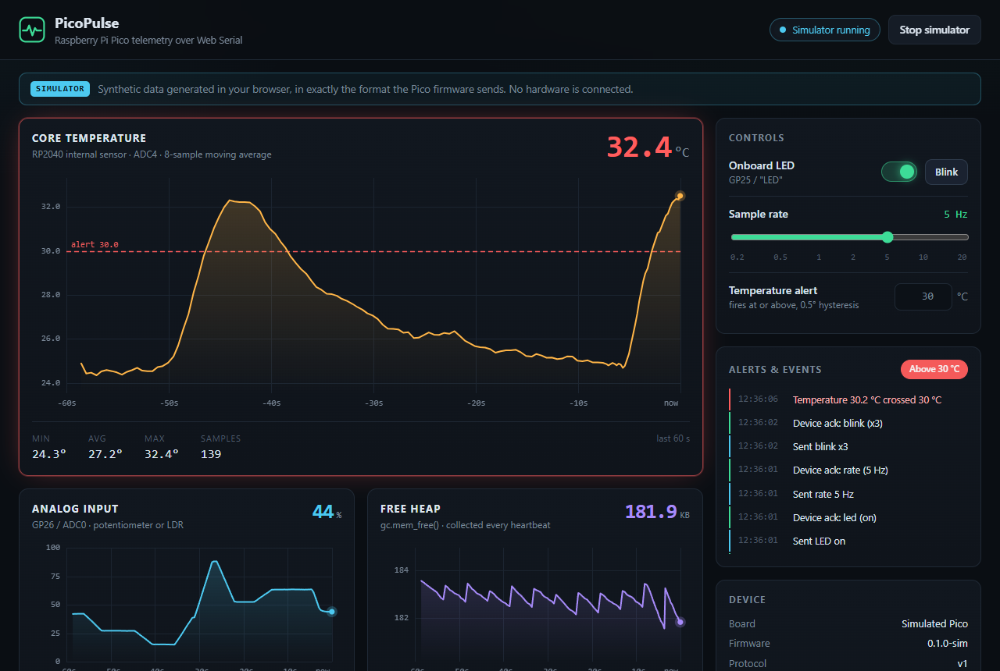
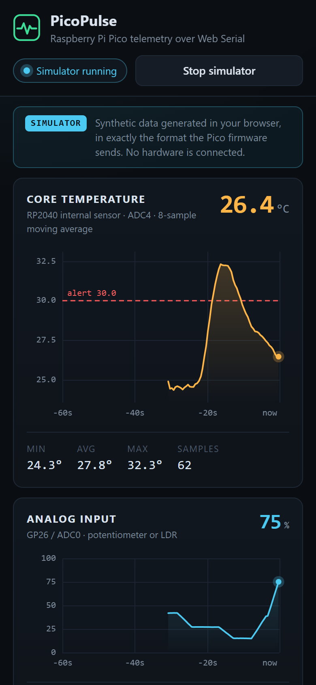
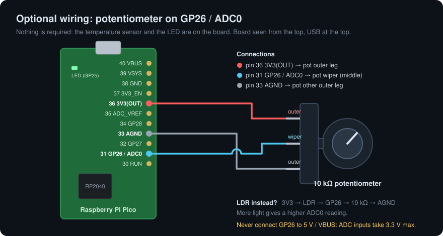
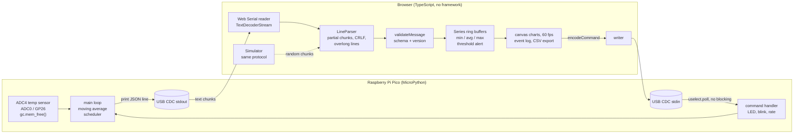

# PicoPulse

**Live telemetry from a Raspberry Pi Pico to your browser over USB — no drivers, no server, no app to install.**

A MicroPython firmware streams the RP2040's internal temperature, an optional
analog input, uptime and free memory as newline-delimited JSON over USB serial.
A TypeScript dashboard reads it with the **Web Serial API**, draws live charts,
raises threshold alerts, exports CSV, and sends commands back to the board
(LED, blink, sample rate).

**Live demo:** https://naniiic137.github.io/picopulse/ — it will be available once GitHub Pages is enabled for this repository.
No Pico? Press **Run simulator** to see synthetic data in the same format (clearly labelled as simulated).



| Alert raised, LED on, rate changed to 5 Hz | Mobile layout |
|---|---|
|  |  |

*Screenshots were taken in simulator mode. See [Tested on](#tested-on).*

## What you need

- A **Raspberry Pi Pico** (a Pico W works too) and a **USB data cable**.
- **Chrome or Edge on desktop** (Web Serial is not available in Firefox, Safari or mobile browsers).
- Optional: a 10 kΩ potentiometer (or an LDR plus a 10 kΩ resistor) on GP26 / ADC0.

Nothing else is needed: the temperature sensor and the LED are on the board.



## Quick start

### 1. Flash MicroPython (once)

1. Download the `.uf2` for your board from micropython.org:
   [Pico](https://micropython.org/download/RPI_PICO/) or [Pico W](https://micropython.org/download/RPI_PICO_W/).
2. Hold **BOOTSEL**, plug the Pico in, release. A drive called `RPI-RP2` appears.
3. Copy the `.uf2` onto it. The board reboots into MicroPython.

### 2. Copy the firmware

With **Thonny**: *Tools → Options → Interpreter → MicroPython (Raspberry Pi Pico)*,
open `firmware/main.py`, then *File → Save as… → Raspberry Pi Pico* and save it as `main.py`.

Or with **mpremote**:

```bash
pip install mpremote
mpremote cp firmware/main.py :main.py
mpremote reset
```

`main.py` runs on every boot. **Close Thonny / mpremote afterwards**: only one
program can hold the serial port at a time.

### 3. Open the dashboard

Use the hosted page, or run it locally:

```bash
cd web
npm install
npm run dev          # http://localhost:5183
```

Press **Connect Pico** and pick the Pico in the browser's port list (it is
filtered on Raspberry Pi's USB vendor ID, `2e8a`).

## Try it without a board

- **In the browser:** press **Run simulator** (or open `?sim`). A small model of the
  Pico produces the same JSON lines, chopped into random chunks like real USB reads,
  and they go through the same parser and validator as serial data.
- **On Wokwi:** the firmware itself runs in the [Wokwi](https://wokwi.com) simulator
  with a potentiometer on GP26:
  1. Open the [MicroPython Pi Pico template](https://wokwi.com/projects/new/micropython-pi-pico).
  2. Replace `main.py` with [`firmware/main.py`](firmware/main.py) and `diagram.json`
     with [`firmware/diagram.json`](firmware/diagram.json).
  3. Start the simulation. The JSON lines appear in the serial monitor; you can type
     commands such as `{"cmd":"rate","hz":5}` there. Turn the potentiometer to change `adc0`.

  Wokwi's temperature sensor always reads 0, so `temp` is reported as `null` there (the
  firmware rejects impossible readings rather than showing 437 °C). The browser
  dashboard cannot connect to Wokwi; use its serial monitor.
  If Wokwi rejects the MicroPython version pinned in `diagram.json`'s `env`
  attribute, keep the template's Pico part and copy only the potentiometer and the
  three connections.

  For **Wokwi for VS Code**, [`firmware/wokwi.toml`](firmware/wokwi.toml) explains the steps
  (download the MicroPython `.uf2` next to it, start the simulator, then
  `python -m mpremote connect port:rfc2217://localhost:4000 run main.py`).

## How it works



- **Firmware** ([`firmware/main.py`](firmware/main.py)): a single cooperative loop that
  never blocks. Each pass drains stdin with `uselect.poll(0)`, advances the LED blink
  state machine, and sends a sample when the next `ticks_ms` deadline has passed.
  Temperature uses the datasheet formula `27 − (V − 0.706) / 0.001721` and an
  8-sample moving average. The LED works on both boards (`Pin("LED")`, falling back
  to `Pin(25)`).
- **Protocol** ([`docs/PROTOCOL.md`](docs/PROTOCOL.md)): `hello`, `tel`, `hb`, `ack`,
  `err` messages from the device; `led`, `blink`, `rate`, `info`, `ping`, `reset_stats`
  commands to it. Versioned through the `hello` message.
- **Dashboard** ([`web/src`](web/src)): the charts are plain `<canvas>` code (~240 lines,
  no chart library). The x axis is "seconds ago", redrawn every animation frame, so
  the trace scrolls smoothly whatever the sample rate.

## Tests

```bash
cd web && npm test                                  # Vitest: 45 tests
cd web && npm run build                             # type-check (tsc) + production build
python -m unittest discover -s firmware/tests -v    # 11 firmware logic tests (stubbed hardware)
python -m py_compile firmware/main.py firmware/examples/mqtt_picow.py
```

- **Web (Vitest):** the line parser (chunk boundaries, CRLF, one byte at a time,
  overlong lines), message validation (every message type, bad types, out-of-range
  values, protocol version), statistics and the alert hysteresis, CSV export, tick
  generation, and the simulator (every line it emits passes validation, rate
  changes, command replies).
- **Firmware:** CPython cannot import `machine` or `uselect`, so the tests replace them
  with small fakes and check the moving average, the temperature formula, command
  parsing (including a command split across reads and an overlong line), the rate
  limits and the blink sequence. This checks the logic, not the hardware.

GitHub Actions runs both on every push ([`ci.yml`](.github/workflows/ci.yml)) and deploys
the dashboard to GitHub Pages from `main` ([`pages.yml`](.github/workflows/pages.yml)).

## Tested on

| What | Status |
|---|---|
| Dashboard with the simulator, headless Chrome via Puppeteer (1280 px desktop and 390 px mobile viewports) | Done |
| Web unit tests and production build | Passing |
| Firmware logic on CPython with stubbed hardware | Passing |
| Firmware on a real Raspberry Pi Pico | **Pending.** The owner will test it on his Pico and update this section |
| Firmware on a Pico W | Not tested |
| `examples/mqtt_picow.py` (Pico W, MQTT) | Not tested on hardware |
| Wokwi | Files written against the Wokwi docs; not yet run on wokwi.com |

Things that most need checking on hardware: the ADC0 "not connected" detection
(a pull-up / pull-down heuristic), that output starts as soon as the dashboard
connects, and the LED on older MicroPython builds.

## Optional: Pico W over MQTT

[`firmware/examples/mqtt_picow.py`](firmware/examples/mqtt_picow.py) is a separate,
minimal example that publishes the same `tel` messages to an MQTT broker over WiFi
using `umqtt.simple`. It is **untested on hardware** and not used by the dashboard.

## Project structure

```
picopulse/
├── firmware/
│   ├── main.py                 # MicroPython firmware (copy to the board as main.py)
│   ├── diagram.json            # Wokwi circuit: Pico + potentiometer on GP26
│   ├── wokwi.toml              # Wokwi for VS Code config
│   ├── examples/mqtt_picow.py  # optional Pico W MQTT example (untested)
│   └── tests/test_main.py      # host-side tests with stubbed hardware
├── web/
│   ├── index.html
│   ├── src/
│   │   ├── main.ts             # UI wiring
│   │   ├── transport.ts        # Web Serial + simulator transports
│   │   ├── lineParser.ts       # chunks -> lines
│   │   ├── protocol.ts         # message types, validation, command encoding
│   │   ├── simulator.ts        # fake Pico speaking the same protocol
│   │   ├── stats.ts            # ring buffers, min/avg/max, threshold alert
│   │   ├── chart.ts            # canvas time-series chart
│   │   ├── csv.ts              # CSV export
│   │   └── style.css
│   └── tests/                  # Vitest
├── docs/
│   ├── PROTOCOL.md
│   ├── wiring.svg
│   └── screenshots/
└── .github/workflows/          # CI + GitHub Pages
```

## Tech stack

- **Device:** Raspberry Pi Pico (RP2040), MicroPython (`machine.ADC`, `machine.Pin`, `uselect`, `json`, `gc`)
- **Browser:** TypeScript, Vite, Web Serial API, Canvas 2D, no UI framework, no runtime dependencies
- **Tooling:** Vitest, Python `unittest`, GitHub Actions, GitHub Pages, Wokwi

## Troubleshooting

- **"Connect Pico" is greyed out:** the browser has no Web Serial. Use Chrome or Edge on desktop.
- **"Could not open the port":** Thonny, mpremote or another serial monitor still has it. Close it.
- **The Pico is not in the port list:** check that the cable carries data (some are charge-only) and that MicroPython is flashed.
- **Only text lines, no charts:** `main.py` is not running (e.g. it stopped with an error, shown in the event log). Reset the board.

## Author

Hamza Ben Ismail ([@naniiic137](https://github.com/naniiic137)), Tunisia.

## License

Not chosen yet.
